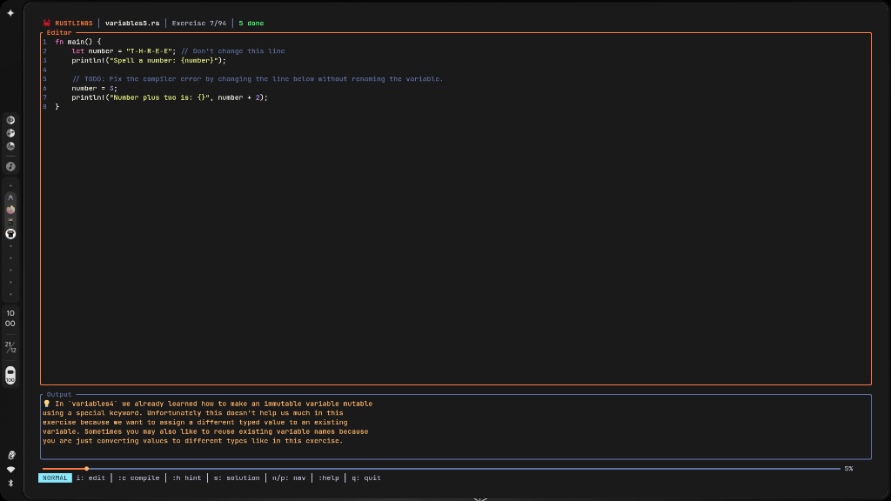
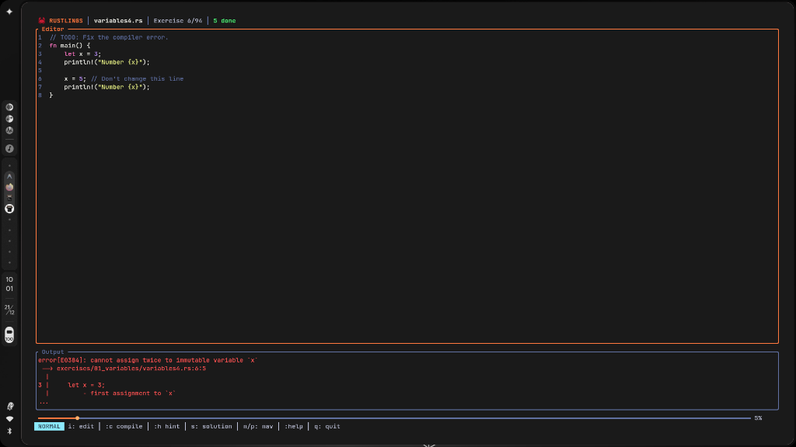
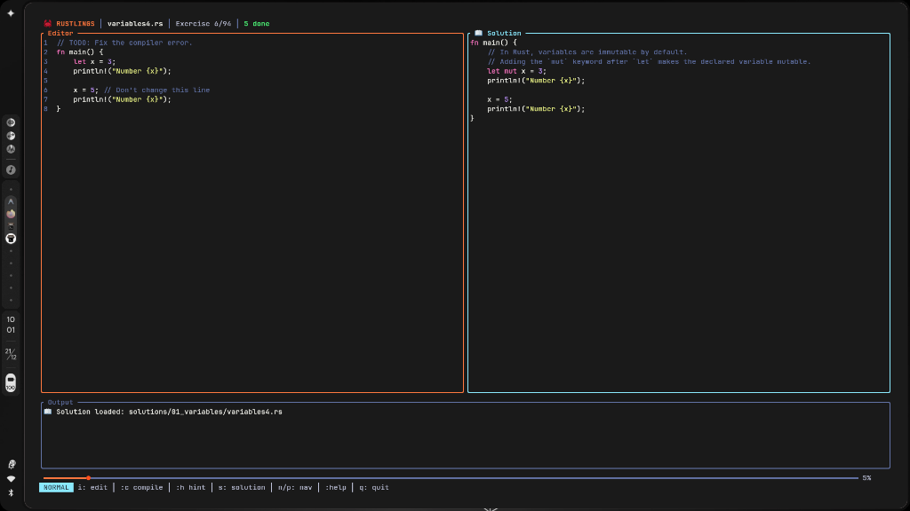

<div align="center">

<br>

# 🦀 Rustlings TUI

### The Premium, Interactive Way to Learn Rust

<br>

[](https://www.rust-lang.org/)
[](https://ratatui.rs/)
[](LICENSE)
[](http://makeapullrequest.com)

<br>



<br>

A **modern**, **immersive** Terminal User Interface for [Rustlings](https://github.com/rust-lang/rustlings).  
Designed to transform learning Rust into a **beautiful**, **seamless**, and **frustration-free** experience.

<br>

[**Features**](#-features) &nbsp;•&nbsp; [**Quick Start**](#-quick-start) &nbsp;•&nbsp; [**Controls**](#-controls) &nbsp;•&nbsp; [**FAQ**](#-faq) &nbsp;•&nbsp; [**Contributing**](#-contributing)

<br>

</div>

---

## 💡 Why Rustlings TUI?

The original Rustlings is fantastic, but the workflow can be clunky:

| Original Rustlings | Rustlings TUI |
| :--- | :--- |
| ❌ Requires switching between terminal and editor | ✅ **All-in-one** terminal experience |
| ❌ Manual file watching and compilation | ✅ **Auto-compile** on file save |
| ❌ Scroll through terminal history for errors | ✅ **Integrated output panel** with smart scrolling |
| ❌ Open solution files manually | ✅ **Side-by-side solution view** with one keystroke |
| ❌ No visual progress feedback | ✅ **Animated progress bar** with completion metrics |

<br>

---

## ✨ Features

<table>
<tr>
<td width="50%">

### 🖥️ Immersive Editor

Forget context switching. Code directly in the terminal with a **Vim-inspired editor**.

- **Syntax Highlighting** — Theme-aware Rust coloring
- **Line Numbers** — Always know where you are
- **Vim Bindings** — `h`/`j`/`k`/`l`, `i`nsert, commands

</td>
<td width="50%">

### 🚀 Real-Time Feedback

Instant compilation results without leaving your flow.

- **Inline Errors** — `rustc` output right below your code
- **Smart Scrolling** — Auto-focus on relevant errors
- **On-Demand Hints** — `:hint` when you're stuck

</td>
</tr>
<tr>
<td width="50%">

### 📊 Progress Tracking

Stay motivated with a **pulse-animated progress bar**.

- **Live Animation** — Breathing indicator of your session
- **Precise Metrics** — Completion % and done count

</td>
<td width="50%">

### 🆚 Solution View

Learn idiomatic Rust with **side-by-side comparisons**.

- **One Keystroke** — Press `s` to toggle
- **Syntax Highlighted** — Easy to read and study

</td>
</tr>
</table>

<br>

<div align="center">

<br><br>

</div>

<br>

---

## 🚀 Quick Start

**Prerequisites:** Rust 1.70+ installed ([rustup.rs](https://rustup.rs))

```bash
# Clone the repository
git clone https://github.com/Rust-Frog/Rust-Progress.git
cd Rust-Progress

# Install the binary
cargo install --path . --force

# Launch
rustlings
```

That's it. You're in. 🎉

<br>

---

## 🎮 Controls

Designed for **keyboard power users**, friendly for everyone.

### Navigation

| Key | Action |
| :---: | :--- |
| `]` | **Next** exercise |
| `[` | **Previous** exercise |
| `Shift+J` / `PgDn` | Scroll output **down** |
| `Shift+K` / `PgUp` | Scroll output **up** |

### Editing

| Key | Action |
| :---: | :--- |
| `i` | Enter **Insert** mode |
| `Esc` | Return to **Normal** mode |
| `h` `j` `k` `l` | Vim-style cursor movement |
| `:w` | **Save** file |

### Commands

| Command | Action |
| :---: | :--- |
| `:c` | **Compile** / Check code |
| `:hint` or `h` | Show **Hint** |
| `:sol` or `s` | Toggle **Solution** view |
| `:auto` | Toggle **Auto-Advance** |
| `:watch` | Toggle **Auto-Compile** on save |
| `:reset` | **Reset** exercise to original |
| `:reload` or `r` | **Reload** file from disk |
| `:q` or `q` | **Quit** |

<div align="center">
<br>

</div>

<br>

---

## ❓ FAQ

<details>
<summary><b>Can I use my own external editor alongside this?</b></summary>
<br>
Yes! Enable <code>:watch</code> mode and the TUI will auto-compile whenever the file changes on disk. Edit in VS Code, Neovim, or any editor you prefer.
</details>

<details>
<summary><b>Does this work on Windows / macOS / Linux?</b></summary>
<br>
Yes, it's cross-platform. Built with <a href="https://crossterm.rs">crossterm</a> for maximum terminal compatibility.
</details>

<details>
<summary><b>How do I skip an exercise?</b></summary>
<br>
Press <code>n</code> to go to the next exercise. You can come back anytime with <code>p</code>.
</details>

<details>
<summary><b>Where are my progress files stored?</b></summary>
<br>
Progress is saved in <code>.rustlings-state.txt</code> at the repository root.
</details>

<br>

---

## 🤝 Contributing

Contributions are welcome! Whether it's a bug fix, new feature, or documentation improvement:

1. **Fork** this repository
2. **Create** a feature branch (`git checkout -b feature/amazing`)
3. **Commit** your changes (`git commit -m 'Add amazing feature'`)
4. **Push** to the branch (`git push origin feature/amazing`)
5. **Open** a Pull Request

Please ensure your code passes `cargo clippy` and `cargo fmt` before submitting.

<br>

---

## 🛠️ Tech Stack

| Component | Technology |
| :--- | :--- |
| **Language** | Rust 🦀 |
| **TUI Framework** | [Ratatui](https://ratatui.rs) |
| **Terminal Backend** | [Crossterm](https://github.com/crossterm-rs/crossterm) |
| **Based On** | [Rustlings](https://github.com/rust-lang/rustlings) |

<br>

---

## 📜 License

This project is licensed under the **MIT License** — see the [LICENSE](LICENSE) file for details.

<br>

---

<div align="center">

<br>

**Built with ❤️ for the Rust community**

<br>

⭐ Star this repo if you find it useful!

<br><br>

</div>
